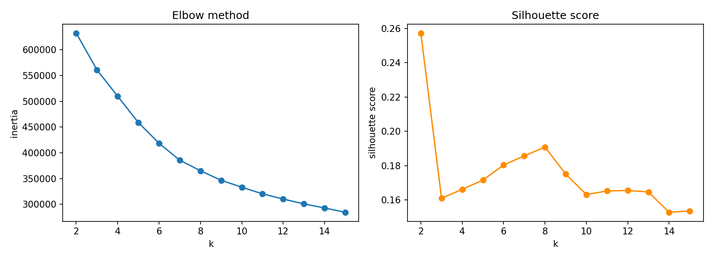
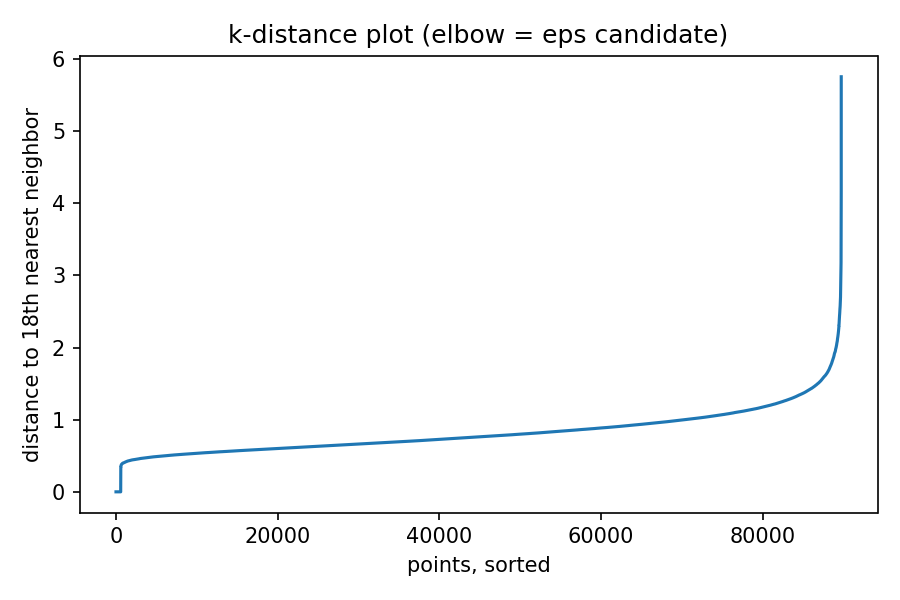
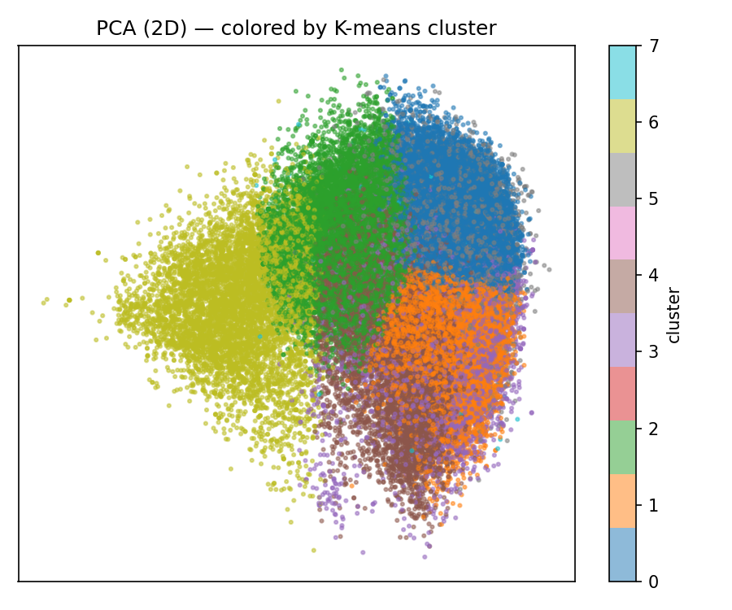
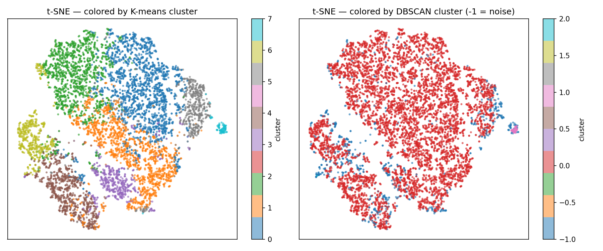

# Music Genre Clustering — K-means vs. DBSCAN on Spotify Audio Features

Unsupervised clustering on the [Spotify Tracks Dataset](https://www.kaggle.com/datasets/maharshipandya/-spotify-tracks-dataset) (114,000 tracks, 114 genres) — groups songs by audio character alone (tempo, energy, danceability, acousticness, valence, loudness, speechiness, instrumentalness, liveness), with genre used only afterward, to characterize what the clusters found and how well that lines up with genre. Genre is never a clustering input.

This is the portfolio's first unsupervised project — everything else (churn prediction, document classification, demand forecasting, entity extraction) is supervised. The point here isn't to "beat a benchmark," it's to do genuine unsupervised clustering and report honestly on what structure does and doesn't exist in the data.

## Pipeline

1. **Data acquisition & exploration** — downloaded fully via `kaggle datasets download` (no streaming). 114,000 rows, 20 columns, no missing audio features. Found 24,259 duplicate `track_id`s (21%) — the same track re-listed under multiple genres, not bad data.
2. **Preprocessing** — deduped to 89,741 unique tracks (genre tags kept as a list per track rather than picking one arbitrarily). Selected the 9 audio-character features; dropped `popularity` (listenership, not sound), `duration_ms`/`time_signature`/`explicit`/`key`/`mode` (structural/categorical, poor fit for Euclidean distance). log1p on `speechiness`/`instrumentalness`/`liveness` (zero-inflated, skew 1.7–4.6), then `StandardScaler`.
3. **K selection & K-means** — elbow method + silhouette score across k=2–15. No sharp elbow (gradual decay — expected for a continuum, not discrete blobs). Silhouette peaks at k=2 (0.257, trivial one-axis split) with a local max at k=8 (0.191) where the elbow also flattens. Chose **k=8**.
4. **DBSCAN comparison** — eps=1.0 (from k-distance elbow), min_samples=18 (2× feature count). Found one giant cluster (90% of tracks), two tiny ones, 9.1% noise. **ARI vs. K-means = 0.043** — essentially no agreement.
5. **Visualization** — PCA (48.1% variance in 2D) and t-SNE (8,000-track subsample) projections, colored by both cluster assignments.
6. **Evaluation against genre** — post-hoc only. Rejoined cluster labels onto the original (non-deduped) rows so every genre tag a track carries gets counted, rather than picking one. NMI vs. `track_genre`: K-means = 0.172, DBSCAN = 0.025.

## Why K-means and DBSCAN disagree

This is the central finding, not a side note. DBSCAN only splits a cluster where there's a genuine density *gap*; finding that 90% of tracks collapse into one blob means **the 9-dimensional audio-feature space is one continuous manifold, not several separated dense regions**. K-means doesn't need density gaps — it partitions space into Voronoi cells regardless of whether real boundaries exist, so it always produces 8 clusters whether or not the data actually has 8 natural groups.

Neither algorithm is "wrong." It means genre-as-expressed-through-these-9-features behaves like a continuum (metal blends into rock blends into alternative) rather than discrete islands — which is a reasonable prior for music to begin with. K-means still extracts genuinely interpretable structure (see below) by cutting along the space's dominant variance axes even without density gaps to guide it; DBSCAN's more conservative "leave it as noise" behavior means it can't discriminate *within* the big blob at all, which is why its genre-alignment (NMI 0.025) is so much lower than K-means' (0.172).

**The one thing both algorithms agree on**: K-means' smallest cluster (960 tracks) lines up almost exactly with a DBSCAN cluster, largely independent of the giant blob. Both algorithms, and both 2D projections (PCA and t-SNE), independently isolate this same group — see cluster 7 below.

| | K-means (k=8) | DBSCAN (eps=1.0) |
|---|---|---|
| Clusters | 8 | 3 (+ noise) |
| Cluster sizes | 960 – 23,513 | 44, 560, 80,929 (+ 8,208 noise) |
| Silhouette (k=8) | 0.191 | — |
| NMI vs. genre | **0.172** | 0.025 |
| Agreement (ARI) | — | 0.043 |




## Cluster interpretations

No cluster's top genre exceeds ~11% share — expected, not a failure: the dataset has 114 fine-grained, overlapping, multi-label genre tags (`metal`/`heavy-metal`/`metalcore`/`grunge` as four separate labels for closely related sounds), so no single genre could dominate a broad acoustic cluster even in principle. The **feature profile** (how far each cluster's mean sits from the global mean, in standard deviations) is the more reliable characterization:

| Cluster | Tracks | Sound profile | Top genres |
|---|---|---|---|
| 0 | 23,513 | ↑ valence (+0.9sd), ↑ danceability (+0.7sd) | salsa, reggaeton, latino, latin, reggae |
| 1 | 18,224 | ↓ acousticness (−0.7sd), ↑ energy/loudness (+0.7/+0.6sd) | metalcore, heavy-metal, grunge, metal, dubstep |
| 2 | 17,231 | ↑↑ acousticness (+1.1sd), ↓↓ energy (−1.1sd) | honky-tonk, tango, romance, jazz, cantopop |
| 3 | 6,675 | ↑↑↑ liveness (+2.6sd) — live recordings | pagode, sertanejo, samba, mpb, gospel |
| 4 | 10,439 | ↑↑ instrumentalness (+2.0sd), ↓ valence (−0.5sd) | minimal-techno, detroit-techno, techno, study, grindcore |
| 5 | 6,039 | ↑↑ speechiness (+2.0sd), ↑ danceability (+0.8sd) | j-dance, dancehall, funk, kids, hip-hop |
| 6 | 6,660 | ↓↓↓ loudness (−2.6sd), ↑↑ instrumentalness (+2.0sd) | new-age, sleep, classical, ambient, piano |
| **7** | **960** | **↑↑↑↑↑↑↑ speechiness (+7.4sd)**, ↑↑ liveness (+2.6sd) | **comedy (83%)**, show-tunes, kids, children |

Clusters 0–6 read as real musical dimensions — energy/loudness (aggressive vs. mellow), acousticness (organic vs. electronic), instrumentalness (vocal vs. instrumental) — that partially but not cleanly track genre, exactly the "continuum, not discrete genres" story from the algorithm comparison above.

**Cluster 7 is the exception, and it's a clean one.** It's spoken-word comedy — 83% tagged `comedy`, speechiness at +7.4 standard deviations above the global mean (next-highest anywhere in the table is +2.6sd). Both K-means and DBSCAN isolate it independently, and it appears as a literal separated island in both the PCA and t-SNE projections below. It's the one place in this dataset where "cluster" and "genre" really do mean nearly the same thing — because comedy albums are acoustically nothing like music (the whole point of the other 8 audio features is to describe music, not talking), not because clustering solved genre in general.




Full per-cluster numbers: [`results/cluster_genre_summary.csv`](results/cluster_genre_summary.csv).

## Limitations

- **Genre ground truth is noisy.** 21% of tracks are tagged under 2+ genres (Spotify's genre field here is closer to "search category a track was found under" than a single true label), and many of the 114 labels are near-synonyms. NMI/ARI numbers are a reasonable directional signal, not a precise "% correct" score — clustering isn't classification, and grading it as one would overstate what genre labels here actually are.
- **Silhouette scores are weak in absolute terms** (peak 0.191 for K-means at k≥3; 0.257 only at the trivial k=2). By silhouette conventions that's "little substantial structure" rather than a strong signal — consistent with the DBSCAN finding of one continuous blob. The clusters found are real (both algorithms and both projections agree on cluster 7, and K-means' other 7 clusters have coherent, distinct feature profiles), but they're soft regions of a continuum, not tightly separated groups, and the write-up above tries not to overstate that.
- **t-SNE is run on an 8,000-track subsample**, not the full 89,741, for runtime reasons — and t-SNE is known to visually exaggerate cluster separation relative to the original high-dimensional distances, so the apparent tightness in that plot shouldn't be read as more real than the PCA plot (48.1% variance, visibly blended) shows.
- **Audio features alone can't capture everything genre reflects** — instrumentation choice, production style, lyrical content (beyond speechiness), and cultural/historical context all shape genre and aren't in these 9 numbers. Cluster 7 (comedy) works cleanly precisely because it's an extreme case (spoken word vs. music) — most genre distinctions are subtler than that and this dataset's audio features alone are not going to draw them cleanly.

## Project structure

```
src/explore.py            Step 1: load raw data, check missing values/genre coverage/correlations
src/preprocess.py         Step 2: dedup, feature selection, log1p + StandardScaler
src/cluster_kmeans.py     Step 3: elbow + silhouette K selection, final K-means fit
src/cluster_dbscan.py     Step 4: k-distance eps selection, DBSCAN fit, comparison vs K-means
src/visualize.py          Step 5: PCA + t-SNE 2D projections
src/evaluate.py           Step 6: NMI vs genre, per-cluster genre/feature profiles
data/raw/                 Downloaded dataset (gitignored, re-download via kaggle CLI)
data/processed/           Scaled features + cluster assignments (gitignored, regenerated by scripts)
results/                  Plots + cluster summary CSV (committed)
```

## Running it

```bash
pip install -r requirements.txt

kaggle datasets download -d maharshipandya/-spotify-tracks-dataset -p data/raw --unzip

python src/explore.py        # EDA -> stdout
python src/preprocess.py     # -> data/processed/tracks_scaled.csv
python src/cluster_kmeans.py # -> results/kmeans_k_selection.png, data/processed/tracks_clustered.csv
python src/cluster_dbscan.py # -> results/dbscan_k_distance.png, adds dbscan_cluster column
python src/visualize.py      # -> results/pca_kmeans.png, results/tsne_clusters.png
python src/evaluate.py       # -> results/cluster_genre_summary.csv, NMI scores -> stdout
```

(`kaggle datasets download` requires a `kaggle.json` API token — see [Kaggle's API docs](https://www.kaggle.com/docs/api).)
